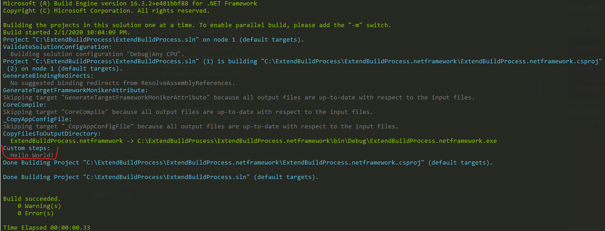
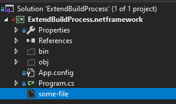

# Extending the build process using the nuget package

In these days, when we are using build servers, continues integration - Jenkins, TeamCity, Azure Pipeline and so on,
we forget about such powerfull tool like MsBuild and posibility to extend build process.
In CI tools we can configure build steps, but the whole configuration stays on build server, and usualy those steps can not be reused on developers machines.
It is very good prctice to use CI tools , but sometimes some build steps should be available also on developers machines.
In these cases, msbuild comes in handy.
Decentralized build steps can bring problems when we are working with many projects/solutions, and we have to reuse build step.
In this tutorial you will see how to delivery custom build steps using nuget package.

## Build steps

In `.csproj` we are using `<Targets />` node to group tasks([read more](https://docs.microsoft.com/en-us/visualstudio/msbuild/msbuild-targets)). Msbuil allows to use few types of tasks, which we can use during the build process([read more](https://docs.microsoft.com/en-us/visualstudio/msbuild/assignculture-task))

### Hello World!

Let's start with showing some message in build process. To do it we add [`<Message />` task](https://docs.microsoft.com/en-us/visualstudio/msbuild/message-task) to [`.csproj` file](ExtendBuildProcess.netframework/ExtendBuildProcess.netframework.csproj)

```xml
<Project ToolsVersion="15.0" xmlns="http://schemas.microsoft.com/developer/msbuild/2003">
    ...
    <Target Name="Custom steps" AfterTargets="Build">
        <Message Text="Hello World!" />
    </Target>
</Project>
```

Unfortunatly the result of this change cannot be seen when we build project in Visual Studio, to check if it works we have to use `msbuild.exe`(maybe you can find it in the following path `C:\Program Files (x86)\Microsoft Visual Studio\2019\Enterprise\MSBuild\Current\Bin\MSBuild.exe`)



### Execute external program

To check if our task is executing when we are building in Visual Studio let's change the task to create a file, in order to do it we use [`<Exec />` task](https://docs.microsoft.com/en-us/visualstudio/msbuild/exec-task) and OS instruction `echo "Hello World" >> some-file`

```xml
<Project ToolsVersion="15.0" xmlns="http://schemas.microsoft.com/developer/msbuild/2003">
    ...
    <Target Name="Custom steps" AfterTargets="Build">
        <Message Text="Hello World!" />
        <Exec Command="echo Hello World >> some-file"/>
    </Target>
</Project>
```

After `Clean` and `Build` we can find the file in the project directory



## Extract build steps from csproj

Now we know how to extend the build process, let's move on to transfer the definition to seperate file([read more](https://docs.microsoft.com/en-us/visualstudio/msbuild/how-to-use-the-same-target-in-multiple-project-files)).
To do it let's create a file with following extension `.targets`(for example [`BuildProcessExtension.targets`](BuildProcessExtension/BuildProcessExtension.targets)) then let's transfer the definition to this file

```xml
<Project xmlns="http://schemas.microsoft.com/developer/msbuild/2003">
    <Target Name="Custom steps" AfterTargets="Build">
        <Message Text="Hello World!" />
        <Exec Command="echo Hello World >> some-file"/>
    </Target>
</Project>
```

In `.csproj` we have to add information about this file

```xml
<Project ToolsVersion="15.0" xmlns="http://schemas.microsoft.com/developer/msbuild/2003">
    ...
    <Import Project=".\my-targets.targets" />
</Project>
```

## Put `.targets` into nuget package

At first to create package we need `nuget.exe` file (you can find it [here](https://www.nuget.org/downloads))

```sh
nuget.exe pack .\BuildProcessExtension.nuspec
```

Nuget package should be defined in the file with the following extention [`.nuspec`](BuildProcessExtension/BuildProcessExtension.nuspec)([read more](https://docs.microsoft.com/pl-pl/nuget/create-packages/creating-a-package))

```xml
<package xmlns="http://schemas.microsoft.com/packaging/2010/07/nuspec.xsd">
    <metadata>
        <id>BuildProcessExtension</id>
        <version>0.1</version>
        <description>desc</description>
        <authors>me</authors>
        <dependencies>
          <group targetFramework=".NETFramework4.7.2" />
        </dependencies>
    </metadata>
</package>
```

### Package without `.dll`

When we want to create a package only with build definition we have to add empty file with the name `_._` to `lib` directory in the package([it is official solution](https://docs.microsoft.com/en-us/nuget/reference/errors-and-warnings/nu5127))

```xml
<package xmlns="http://schemas.microsoft.com/packaging/2010/07/nuspec.xsd">
    ...
    <files>
        <file src=".\_._" target="lib\net472" />
    </files>
</package>
```

### Add build steps to package

When `.targets` file will be added to `build` directory in the package then the nuget will add automaticaly `Import` to `.csproj` after installation.

```xml
<package xmlns="http://schemas.microsoft.com/packaging/2010/07/nuspec.xsd">
    ...
    <files>
        ...
        <file src=".\BuildProcessExtension.targets" target="build\net472" />
    </files>
</package>
```
